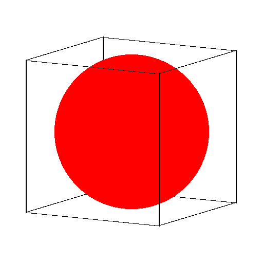

# 法線ベクトル法による隠線処理サンプル

## 概要

こんな感じに隠線処理するサンプルです。



## 実行方法

以下のPythonスクリプトを実行すると、`image.000.png`から`image.059.png`が作られます。

```py
python3 hidden_line.py
```

その後、ImageMagickとかでアニメーションを作ると、どんな感じかわかります。

```sh
convert -delay 3 -loop 0 image.*.png rotate.gif
```

## LICENSE

MIT
